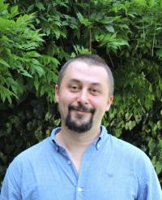

 
 
 
 
 

-----------        -------------------------------------------
Email:             [first name].[last name] [at] boun.edu.tr
Office:            308, John Freely Building, South Campus
Address:           Department of Linguistics
                   Boğaziçi University
                   John Freely Hall, 1st Floor
                   Bebek, 34342 İstanbul, Turkey
-----------        -------------------------------------------
 
 

 
 
 
 

# About me

 

I'm an assistant professor at the [Department of Linguistics](https://linguistics.boun.edu.tr). My main academic interests are sentence processing and cognitive modeling and methodology. 
Before that I did my PhD [Shravan Vasishth's lab](http://www.ling.uni-potsdam.de/~vasishth/), at the Department of Linguistics of University of Potsdam, Germany. 

---

 

